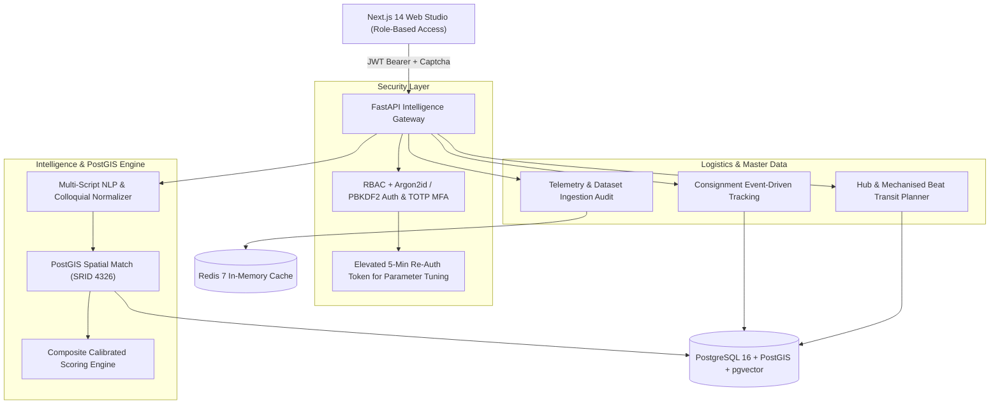

# 🇮🇳 AI-Powered Delivery Post Office Identification System
> **Smart India Hackathon 2026 — Department of Posts (India Post)**  
> National Postal Logistics Intelligence & Automated Address-to-Post Office Resolution Platform.

---

## 📌 Executive Summary

India's postal network comprises over **155,000+ post offices** handling millions of consignments daily. Incomplete, colloquial, multi-lingual, or contradictory postal addresses cause severe dispatch delays, misrouting, and manual sorting bottlenecks.

The **AI-Powered Delivery Post Office Identification System** solves this problem by combining:
- **Multi-Script NLP**: Understands Devanagari (Hindi), Tamil, Telugu, Kannada, Malayalam, Bengali, and Romanized vernacular formats.
- **Colonial & Colloquial Alias Mapping**: Resolves historical city names (*Madras $\to$ Chennai*, *Calcutta $\to$ Kolkata*) and localized neighborhood aliases.
- **PostGIS Spatial Matching (SRID 4326)**: Computes spatial proximity and polygon boundary intersections for ground truth post office matching.
- **Explainable Multi-Factor AI Confidence Scoring**: Transparent breakdown covering Locality Match, PIN Consistency, Geospatial Proximity, Landmark Association, and Historical Routing Patterns.
- **Real-Time Consignment Tracking & Transit Routing**: Automated National Sorting Hub (NSH), Intra-Circle Hub (ICH), transit route planning, and mechanised delivery beat allocation.
- **Zero-Fake-Data Policy**: 100% grounded in authentic PostgreSQL, PostGIS, Kaggle India PIN master datasets, and Datameet spatial boundaries.

---

## 🏛️ System Architecture



---

## 🛠️ Technology Stack

| Layer | Technologies |
|---|---|
| **Frontend** | Next.js 14, React 18, TypeScript, Tailwind CSS, Lucide React Icons |
| **Backend** | Python 3.12, FastAPI, SQLAlchemy 2.0 (Async), Asyncpg, Pydantic v2, Uvicorn |
| **Database & GIS** | PostgreSQL 16, PostGIS 3.5 (SRID 4326), pgvector (HNSW Indexing) |
| **Caching & Auth** | Redis 7, JWT, Argon2id, RFC 6238 TOTP Multi-Factor Authentication |
| **Data Ingestion** | Kaggle Master India PIN/Locality Dataset (21,000+ POs, 155,000+ Localities), Datameet Maps |

---

## 🚀 Quick Start & One-Click Runner

### Prerequisites
- **Windows / Linux / macOS**
- **Docker & Docker Compose** (for PostgreSQL & Redis)
- **Python 3.12+**
- **Node.js 18+**

### 1. Clone the Repository
```bash
git clone https://github.com/manikanta2834/AI-Powered-Delivery-Post-Office-Identification-System.git
cd AI-Powered-Delivery-Post-Office-Identification-System
```

### 2. Configure Environment
```bash
cp .env.example .env
```

### 3. Launch the Platform (Windows Unified Runner)
Run the master script:
```cmd
run.bat
```
This automated script handles:
1. Docker verification for PostgreSQL 16 & Redis 7.
2. Port clearance and kernel socket validation (prevents port conflicts on 8000 & 3000).
3. PostgreSQL collation synchronization and Redis health checks.
4. Auto-detection and ingestion of the postal master dataset and Datameet maps.
5. Launching both FastAPI backend (`http://localhost:8000`) and Next.js Web Studio (`http://localhost:3000`).

---

## 👥 Default Demo Roles & Personas

| Role | Email | Password | Privileges |
|---|---|---|---|
| **Citizen** | `citizen@indiapost.gov.in` | `Citizen@2026` | Address Verification, Real-Time Consignment Tracking |
| **Sorting Operator** | `operator.raman@indiapost.gov.in` | `Operator@2026` | Operational Dashboard, Address Identification, Beat Routing, Consignments |
| **Postal Admin** | `admin.nair@indiapost.gov.in` | `Admin@2026` | Full Access, AI Weight Tuner (Elevated Re-Auth), Dataset Governance |

---

## 📡 REST API Documentation

Once the backend is started, interactive Swagger API documentation is available at:
- **Swagger UI**: [http://localhost:8000/docs](http://localhost:8000/docs)
- **ReDoc**: [http://localhost:8000/redoc](http://localhost:8000/redoc)
- **Health Check**: [http://localhost:8000/api/v1/health](http://localhost:8000/api/v1/health)

### Key Endpoints:
- `POST /api/v1/post-offices/identify`: Grounded PostGIS address ranking with transparent multi-factor confidence breakdown.
- `POST /api/v1/routes/identify`: Multi-hop sorting hub and mechanised delivery beat resolution.
- `GET /api/v1/parcels/{tracking_id}`: Real-time parcel consignment tracking with event history.
- `POST /api/v1/auth/login`: Rate-limited authentication returning JWT tokens and MFA flags.
- `PUT /api/v1/admin/weights`: Persists updated scoring weights (protected by 5-minute elevated re-auth).

---

## 📄 License & Attribution

- Developed for the **Smart India Hackathon (SIH 2026)** — Ministry of Communications, Department of Posts (India Post).
- Postal boundaries adapted from **Datameet Open Maps Project**.
